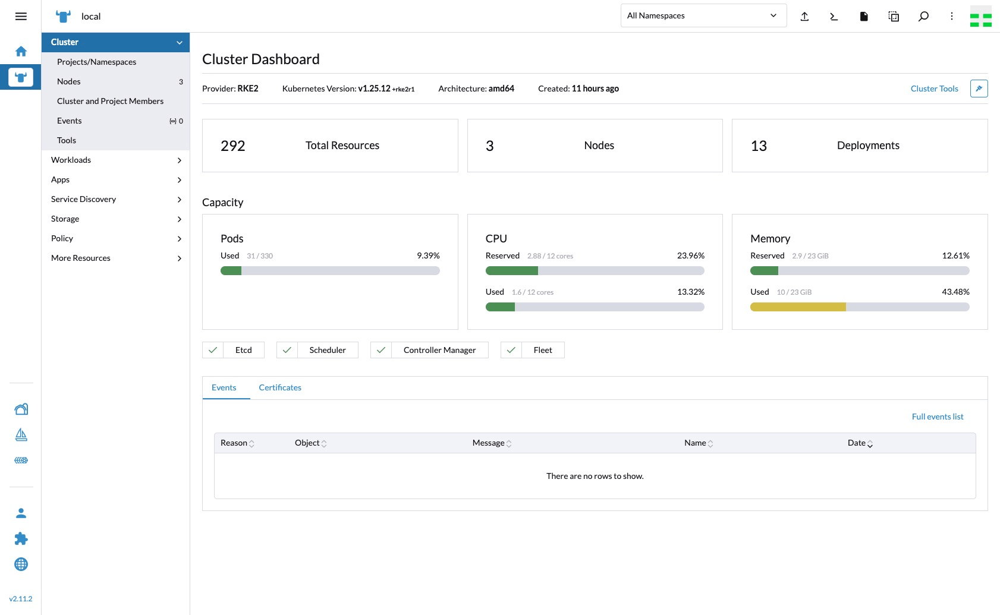

Rancher is my option to manage Kubernetes Cluster, because easy to use and a lot of features to help operate the cluster. Rancher is one of the best Kubernetes distribution I've ever used.

## Environment

I already provisioned 1 server and 2 agent with minimum specification requirement. 


| Hostname | IP Address    | CPU | Memory | Disk |
| -------- | ------------- | --- | ------ | ---- |
| server   | 192.168.10.20 | 2   | 4GB    | 50GB |
| agent01  | 192.168.10.21 | 4   | 8GB    | 50GB |
| agent02  | 192.168.10.22 | 4   | 8GB    | 50GB |
## Configure All Hosts

Update and upgrade linux package lists

```bash
sudo apt update && sudo apt upgrade -y
```

Add these entry to `/etc/hosts`

```bash
cat <<EOF | sudo tee /etc/hosts
192.168.10.20 server server.local
192.168.10.21 agent01 agent01.local
192.168.10.22 agent02 agent02.local
EOF
```

Disable swap memory

```bash
sudo swapoff -a
sudo sed -i '/ swap / s/^\(.*\)$/#\1/g' /etc/fstab
```

Enable `overlay` and `br_netfilter` module

```bash
sudo cat <<EOF | sudo tee /etc/modules-load.d/containerd.conf 
overlay 
br_netfilter 
EOF
```

```bash
sudo modprobe overlay
sudo modprobe br_netfilter
```

Add these kernel parameter for Kubernetes communication

```bash
sudo cat <<EOF | sudo tee /etc/sysctl.d/99-kubernetes-cri.conf 
net.bridge.bridge-nf-call-iptables = 1 
net.ipv4.ip_forward = 1 
net.bridge.bridge-nf-call-ip6tables = 1 
EOF
```

```bash
sudo sysctl --system
```

## Configure the Server Host

Create RKE2 directory

```bash
sudo mkdir -p /etc/rancher/rke2/
sudo mkdir -p /var/lib/rancher/rke2/server/manifests/
```

Create yaml manifest to initialization the cluster

```bash
cat <<EOF | tee /etc/rancher/rke2/config.yaml
tls-san:
  - rz-master01.local
  - 192.168.10.20
  - rz-worker01.local
  - 192.168.10.21
  - rz-worker02.local
  - 192.168.10.22
write-kubeconfig-mode: "0600"
etcd-expose-metrics: true
cni:
  - canal
EOF
```

Create yaml manifest to deploy Nginx Ingress

```bash
cat <<EOF | tee /var/lib/rancher/rke2/server/manifests/rke2-ingress-nginx-config.yaml
apiVersion: helm.cattle.io/v1
kind: HelmChartConfig
metadata:
  name: rke2-ingress-nginx
  namespace: kube-system
spec:
  valuesContent: |-
    controller:
      metrics:
        service:
          annotations:
            prometheus.io/scrape: "true"
            prometheus.io/port: "10254"
      config:
        use-forwarded-headers: "true"
      allowSnippetAnnotations: "true"
EOF
```

Install RKE2 server

```bash
curl -sfL https://get.rke2.io | INSTALL_RKE2_TYPE="server" INSTALL_RKE2_CHANNEL="v1.25.12+rke2r1" sh -
```

Start and enable the systemd service to boostrap the cluster

```bash
sudo systemctl start rke2-server
sudo systemctl enable rke2-server
```

Add these variable to `.bashrc.`

```bash
echo "export PATH=$PATH:/var/lib/rancher/rke2/bin" >> $HOME/.bashrc
echo "export KUBECONFIG=/etc/rancher/rke2/rke2.yaml"  >> $HOME/.bashrc
```

For add another host to the cluster, use this token.

```bash
cat /var/lib/rancher/rke2/server/node-token
...
K108ec5488af002e55bf95565a860b9afb22c90ff4da11efff401fb390af9f330a8::server:748aa8119df0f0f82483afb80d4d4569
...
```

## Configure the Agent Host

Create RKE2 directory

```bash
mkdir -p /etc/rancher/rke2/
```

Create yaml manifest to join agent host to the cluster

```bash
cat <<EOF | tee /etc/rancher/rke2/config.yaml
server: https://192.168.10.20:9345
token: K108ec5488af002e55bf95565a860b9afb22c90ff4da11efff401fb390af9f330a8::server:748aa8119df0f0f82483afb80d4d4569
write-kubeconfig-mode: \"0644\"
EOF
```

Install RKE2 agent

```bash
curl -sfL https://get.rke2.io | INSTALL_RKE2_TYPE="agent" INSTALL_RKE2_CHANNEL="v1.25.12+rke2r1" sh -
```

Start and enable the systemd service to boostrap

```bash
sudo systemctl start rke2-agent
sudo systemctl enable rke2-agent
```

## Deploy Rancher Dashboard

Install Helm3

```bash
curl -fsSL -o get_helm.sh https://raw.githubusercontent.com/helm/helm/main/scripts/get-helm-3
chmod 700 get_helm.sh
./get_helm.sh
```

Add Rancher Dashboard repository and deploy it

```bash
helm repo add rancher-stable https://releases.rancher.com/server-charts/stable
helm repo update
kubectl create namespace cattle-system
helm install rancher rancher-stable/rancher \
  --namespace cattle-system \
  --set hostname=CHANGE_WITH_YOUR_DOMAIN \
  --set bootstrapPassword='P@ssw0rd123456' \
  --set tls=external
```

